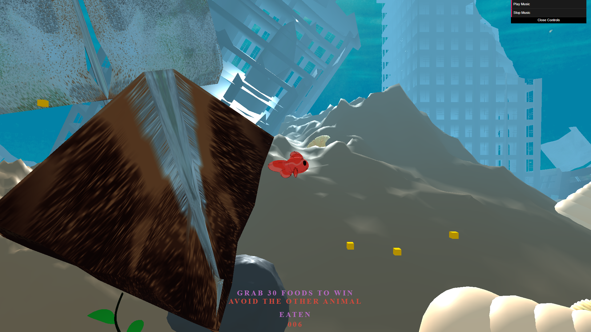

# fish-eat-game

## Overview
**Fish Eat Game** is a 3D web-based game where the player takes on the role of a fish. The objective of the game is to eat food items scattered throughout various scenes, while avoiding being eaten by other fish. The game ends when the player is caught by another fish, and the player must restart. The game includes sound effects for eating food and background music to enhance the experience.

## Features
- **3D Graphics**: Built with **Three.js** for rendering 3D models and environments.
- **Blender Models**: Custom 3D models created in **Blender**.
- **Sound Effects**: Includes sound effects when eating food and background music for gameplay.
- **Game Mechanics**: Avoid other fish while eating the food in the scene. If the player is caught, the game will restart.
- **Web-based**: Playable directly in a browser.

## Installation Guide

1. **Clone the project from GitHub**:
    ```bash
    git clone https://github.com/thara6509681141/thara-project
    ```

2. **Install Python** (if not already installed):
    Download and install Python from [python.org](https://www.python.org/).

3. **Navigate to the project folder**:
    ```bash
    cd fish-eat-game
    ```

4. **Run the HTTP server to test the game**:
    ```bash
    python -m http.server
    ```

5. **Open your browser** and go to `http://localhost:8000` to start the game.

## Technologies Used
- **Three.js**: JavaScript library for 3D graphics.
- **Blender**: 3D modeling tool used to create the fish and food models.
- **Python HTTP Server**: Used to serve the game files locally for testing.

## Game Controls
- Use the arrow keys to control the fish.
- Eat all the food in the scene to advance.

## License
This project is open-source and available under the MIT License.

## Acknowledgements
- **Three.js** for providing the tools to create 3D graphics in the browser.
- **Blender** for creating the 3D models.

## Team Member
- **ธารา ศรีธราดล** - Project Lead, Developer, 3D Modeler
    - Role : Responsible for leading the project, coding the game logic, and creating 3D models in Blender.
- **ธมกร สมานสวน** -  Concept Creator, Game Tester, 3D Modeler
    - Role : Responsible for conceptualizing the game idea, designing game mechanics, testing the game for bugs, and creating 3D models and assets used in the game (such as fish, food, and environment objects) using Blender.
- **ทีฆกานต์ จานเขื่อง** - Project Advisor, Game Optimization
    - Role : Provided project guidance, consulted on technical aspects, and assisted in optimizing game performance for better gameplay experience. Also contributed to creating some 3D models used in the game.
- **ลีนา หมาดหมาน** - 3D Modeler
    - Role : Responsible for creating and sculpting 3D models used in the game, including objects such as fish, food, and environment elements, using Blender.

## Screenshots


